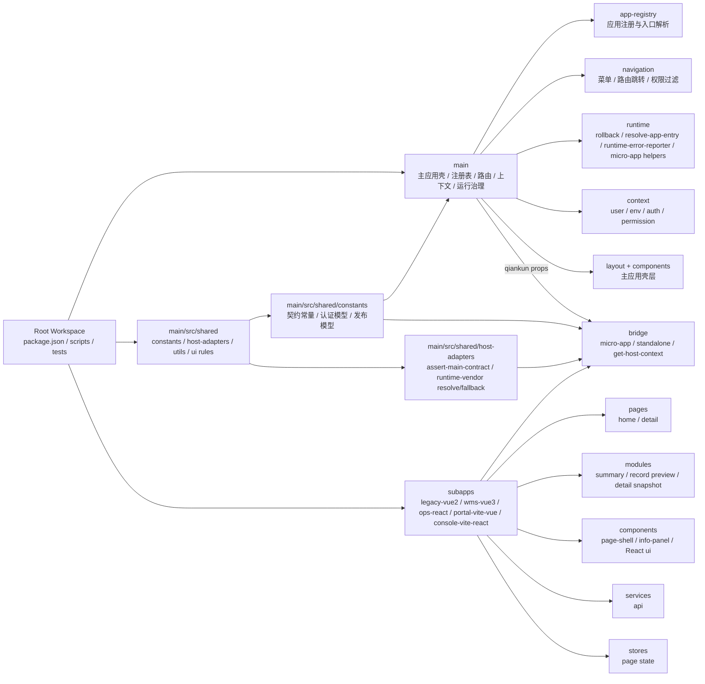
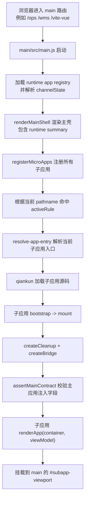

# 当前架构图与挂载流程

## 一、当前架构图

## 二、主应用挂载流程图

## 三、主应用向子应用注入的最小能力

当前主应用注入给子应用的关键能力包括：

1. `actions`
2. `bus`
3. `sharedKernel`
4. `userContext`
5. `envContext`
6. `permissionContext`
7. `navigation`
8. `dependencyPolicy`
9. `contractVersion`
10. `appName`

## 四、当前已经收掉的旧问题

1. `packages/` 抽象层已删除，契约和微应用辅助回并到 `main`
2. webpack 子应用现在显式使用 `props.container`，不会再覆盖主应用根节点
3. rollback 入口已经按 `rollbackApp` 精确命中，不再误伤其他 dedicated-entry 子应用
4. 子应用样式已经强制根容器作用域，避免污染主应用全局字体和背景
